## 👋 Hi, I'm DennisBauer!

## 💼 Featured Project

### [Recurring Expense Tracker](https://github.com/DennisBauer/RecurringExpenseTracker)  

A Material You themed, cross-platform recurring expense tracker built with Kotlin Multiplatform and Compose, featuring:  
- 🧩 **Kotlin Multiplatform** core sharing business logic and resources across Android, iOS, and desktop targets (Windows, Linux, macOS)
- 🎨 **Compose Multiplatform UI** with Material 3 and common UI
- 🔧 **Dependency Injection** via Koin for lightweight, multiplatform DI
- 🗄️ **Room Database** for reactive data layers using Coroutines & Flow
- 🏠 **Home Screen Widgets** on Android powered by Glance Material 3 components for upcoming payment reminders

Feel free to fork, explore the code, or contribute enhancements!

---

## 📈 GitHub Stats

  

  

